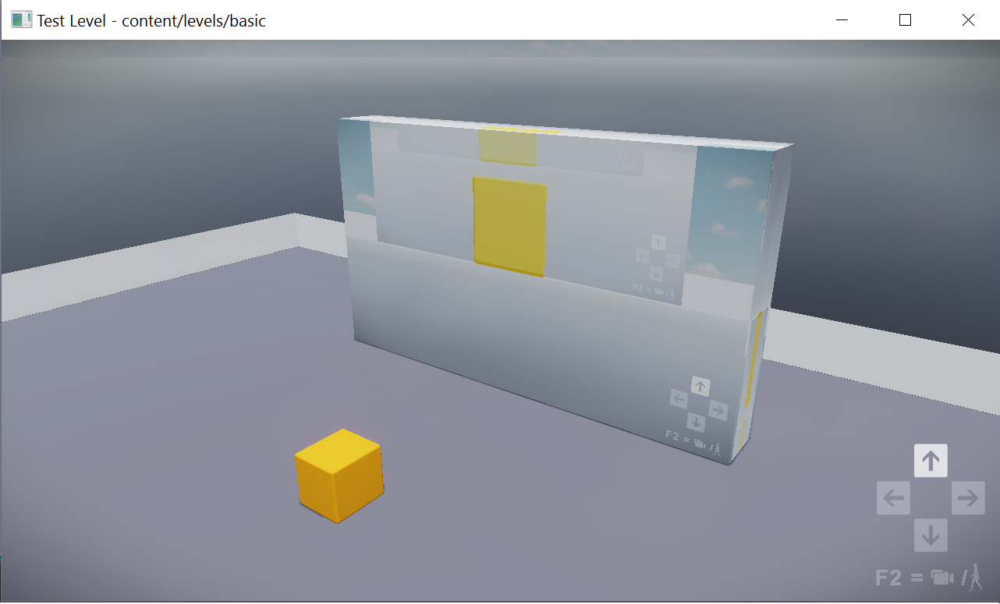
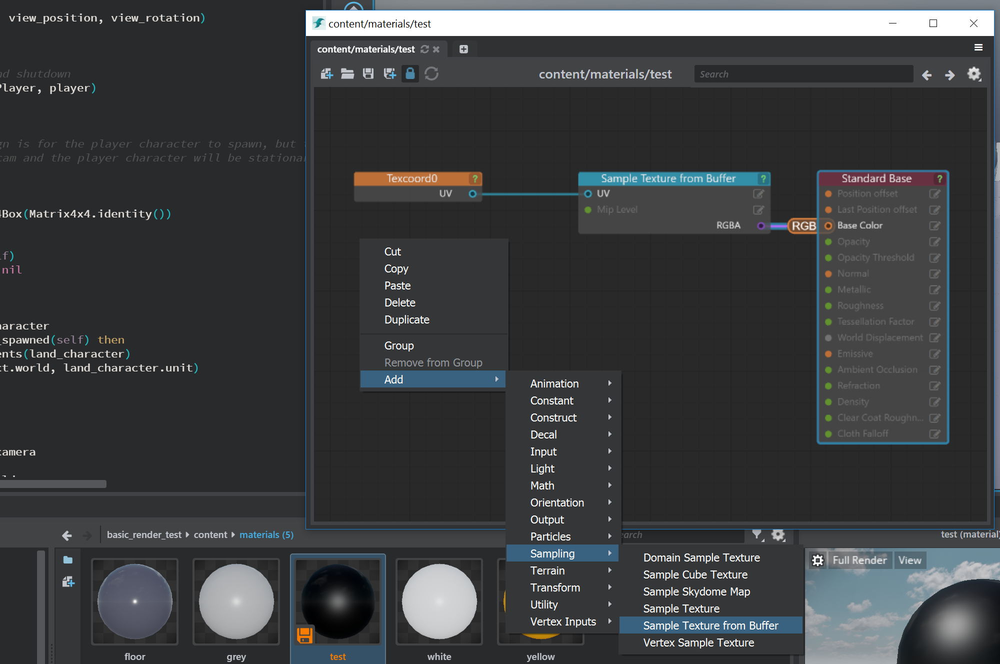

# render_to_texture_plugin v0.01

The Stingray engine doesn't support "render to texture" now, this plugin provides a quick way to achieve "render to texture" feature.

Previous discussion:
https://forums.autodesk.com/t5/stingray-forum/render-to-texture/m-p/6503847

Dan's "Render to Frames" tutorial:
https://www.youtube.com/watch?v=lQ9eHGgf4vY

My prototype project showing the method of doing this:
https://git.autodesk.com/t-heli/render_to_texture_stingray

### Features: ###

Users can render the camera's viewport to a texture, and display on an object.


#### VR version:

The VR version is not completed but we can use it to get a high-quality screenshot or video instead of using default vr_blit screenshot.
This is the render result I use the right controller as a camera:


### How to use: ###

1.Use plugin-manager in Stingray to add this plugin.

2.Make sure the settings.ini has a line pointing out the `render_config_extension` file like this:
```
render_config_extensions = [ "render-to-texture-resources/render_to_texture" ]
```

3.Use VideoCamera class in your project

Sample code:
```
require 'render-to-texture-resources/VideoCamera'

function Project.on_level_load_pre_flow()
  Project.video_camera = VideoCamera(SimpleProject.world)
end

function Project.render()
    Project.video_camera:render()
end
```

Sample code VR version:
```
require 'render-to-texture-resources/VideoCamera'

function Project.on_init_complete()
    Project.video_camera = VideoCamera(SimpleProject.world)
end

function Project.update(dt)
	if not SteamVRSystem.is_enabled(Project.vr_system) then
		return
	end
  
	local right_controller_pose = stingray.SteamVR.controller_world_pose(1)
	Project.video_camera:update_camera_pose(right_controller_pose)
end

function Project.render()
	local managed_world = Appkit.managed_world
	if SteamVRSystem.is_enabled(Project.vr_system) and managed_world then
	    SteamVRSystem.render(Project.vr_system, managed_world.shading_env, Project.viewport, Project.camera_viewport, Project.camera)
	    Project.video_camera:render_vr()
	    return true 
	end
end

```
4.Create a material using `Sample Texture from Buffer` shader_node like this:

